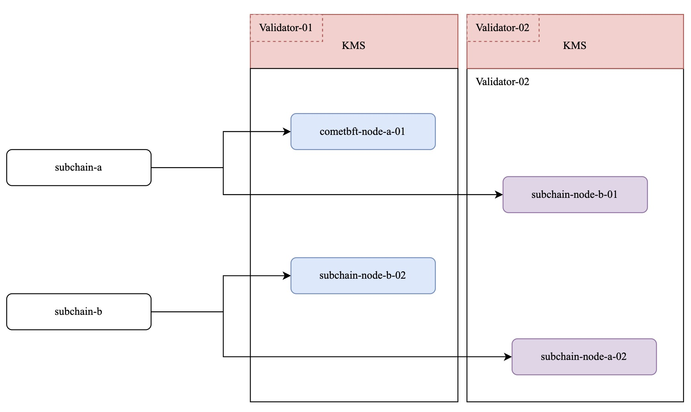
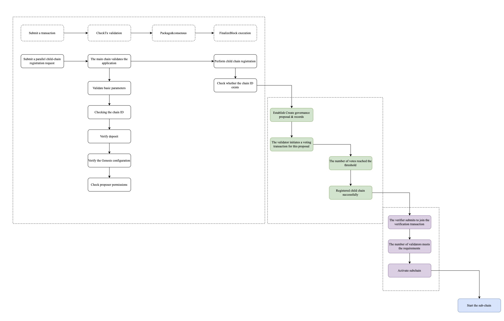
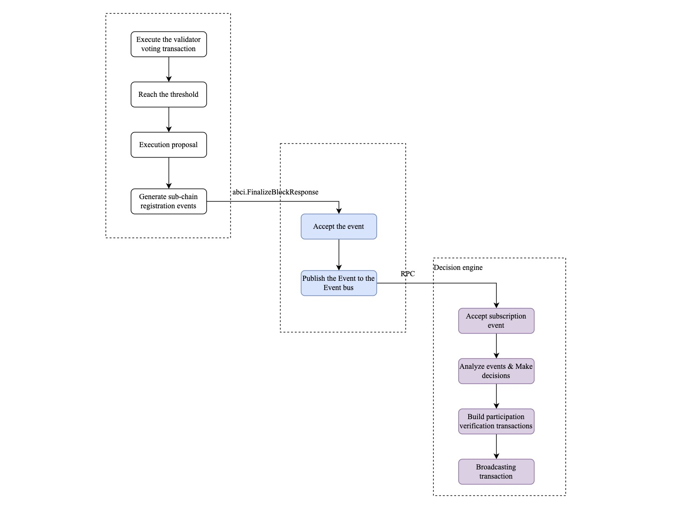
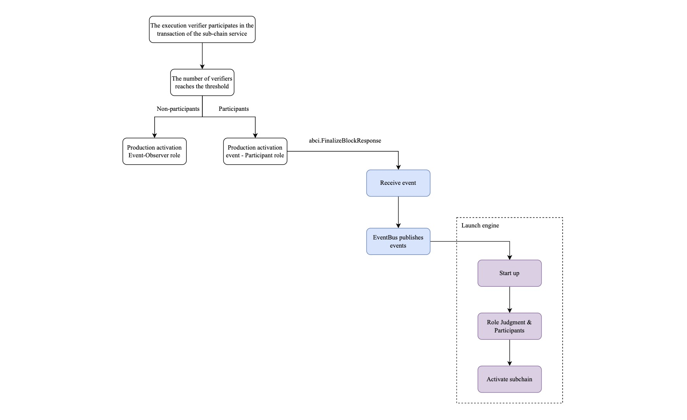
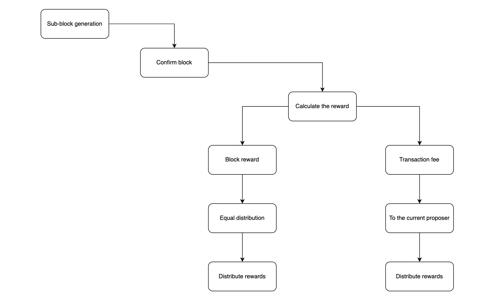

# Parallel Sub-Chain

## Network Topology

## Sub-Chain Registration

The chain needs to provide:
- Transaction types and query interfaces for sub-chain registration
- Voting transaction types for sub-chain registration proposals
- Sub-chain activation transaction types

### Registration Process

1. **Creator submits sub-chain registration transaction**: The creator initiates the registration request through a transaction.

2. **Consensus validation**: During the consensus process, the transaction validity is verified through `checkTx`, and after on-chain confirmation, it is executed by validators.

3. **Governance proposal creation**: After validator execution, a governance proposal is established for the subnet. Validators initiate voting transactions for the subnet. When the vote count exceeds the threshold, the sub-chain status is updated to "registration successful".

4. **Validator participation**: Validators can initiate transactions to provide validation services for the sub-chain. When the number of participating validators reaches the minimum requirement, the sub-chain status is updated to "activated".

5. **Service activation**: Validators start providing validation services for the sub-chain.

## Validator Application Process

After each node's application layer executes voting transactions and the vote count reaches the threshold, a sub-chain registration success event is constructed. This event is passed to the corresponding CometBFT node through ABCI's `FinalizeBlockResponse`. An independent decision program subscribes to this event from the CometBFT node. This decision program determines whether to participate in the sub-chain validation service, and if so, constructs a participation validation transaction.

Each validator, application layer, CometBFT, and independent decision program will execute similar logic.

## Sub-Chain Launch

Within a certain Epoch period, when multiple validators (>3) submit participation validation service transactions and receive confirmation (>3), the node application layer executes `FinalizeBlock`. When the number of participating validators reaches the minimum threshold, it triggers a sub-chain activation event. This event is passed to the corresponding CometBFT node through ABCI's `FinalizeBlockResponse`. CometBFT publishes the transaction event to EventBus. An independent sub-chain activation program subscribes to this event from the CometBFT node, and participating validation nodes will launch the sub-chain.

## Validator Rewards

To improve validator participation and engagement, and to ensure reasonable reward distribution:

### 1. Basic Block Rewards
- **Basic allocation**: 40%
- **Weight-based allocation**: 60%

### 2. Transaction Fees
- **Gas fees**: Received by the current proposer

